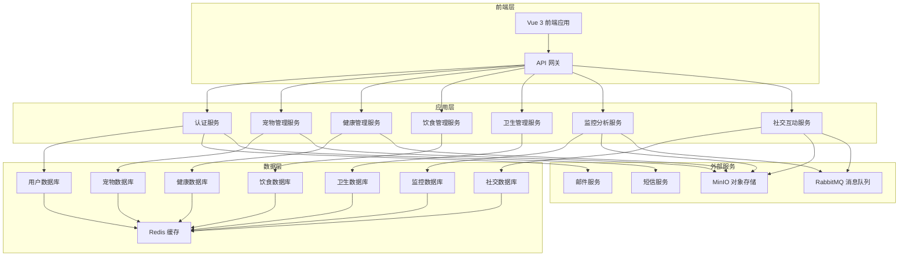

# 宠物管理系统 (PetIMS) 架构设计文档

## 1. 系统概述

PetMIS是一个基于SaaS架构的宠物管理系统，采用前后端分离设计，为宠物主人提供全面的宠物管理功能，包括日常管理、健康管理、饮食管理、卫生管理、日常监控、成长分析、宠友互动和宠物日常分享等功能。

## 2. 技术栈选择

### 前端技术栈
- **框架**: Vue 3 + Vite
- **状态管理**: Pinia
- **路由**: Vue Router
- **UI组件库**: Element Plus
- **HTTP客户端**: Axios
- **样式预处理器**: SCSS
- **图表库**: ECharts (用于数据可视化)
- **文件上传**: vue-upload-component
- **WebSocket**: Socket.io-client (用于实时监控和互动)

### 后端技术栈
- **框架**: Spring Boot 3.0+
- **数据访问**: MyBatis-Plus
- **数据库**: MySQL 8.0+
- **缓存**: Redis
- **认证**: JWT
- **WebSocket**: Spring WebSocket
- **消息队列**: RabbitMQ (用于异步任务)
- **文件存储**: MinIO (对象存储)
- **日志**: ELK Stack
- **监控**: Spring Boot Actuator + Prometheus + Grafana

### 基础设施
- **容器化**: Docker + Docker Compose
- **CI/CD**: GitHub Actions
- **部署**: Kubernetes
- **域名与SSL**: Nginx + Let's Encrypt

## 3. 架构设计

### 3.1 系统架构图

### 3.2 核心架构特点

1. **SaaS多租户架构**
   - 基于租户ID隔离数据
   - 支持多用户、多宠物管理
   - 提供不同级别的服务套餐

2. **微服务设计**
   - 服务模块化，独立部署
   - 服务间通过RESTful API通信
   - 支持水平扩展

3. **前后端分离**
   - 前端：Vue 3 单页应用
   - 后端：Spring Boot 微服务
   - 通过API网关统一管理接口

4. **数据安全**
   - 数据加密存储
   - 细粒度权限控制
   - 审计日志

## 4. 功能模块设计

### 4.1 用户管理模块
- 用户注册/登录
- 个人信息管理
- 租户管理
- 权限管理

### 4.2 宠物基本信息管理
- 宠物档案创建与编辑
- 宠物品种管理
- 宠物基本信息查询
- 宠物照片管理

### 4.3 健康管理模块
- 疫苗接种记录
- 疾病记录
- 体检记录
- 用药记录
- 健康提醒

### 4.4 饮食管理模块
- 饮食计划制定
- 喂食记录
- 营养分析
- 饮食提醒

### 4.5 卫生管理模块
- 洗澡记录
- 美容记录
- 驱虫记录
- 卫生提醒

### 4.6 日常监控模块
- 活动量监控
- 睡眠监控
- 位置追踪
- 异常行为提醒

### 4.7 成长分析模块
- 体重变化分析
- 身高变化分析
- 成长曲线
- 健康状况评估

### 4.8 宠友互动模块
- 宠物社区
- 帖子发布与评论
- 宠物配对
- 宠友圈

### 4.9 宠物日常分享
- 照片/视频分享
- 日常趣事记录
- 分享到社交媒体

## 5. 数据库设计

### 5.1 核心数据表

**users 表**
| 字段名 | 数据类型 | 描述 |
|-------|---------|------|
| id | BIGINT | 用户ID |
| username | VARCHAR(50) | 用户名 |
| password | VARCHAR(100) | 密码 |
| email | VARCHAR(100) | 邮箱 |
| phone | VARCHAR(20) | 手机号 |
| tenant_id | BIGINT | 租户ID |
| create_time | DATETIME | 创建时间 |
| update_time | DATETIME | 更新时间 |

**pets 表**
| 字段名 | 数据类型 | 描述 |
|-------|---------|------|
| id | BIGINT | 宠物ID |
| name | VARCHAR(50) | 宠物名称 |
| species | VARCHAR(50) | 品种 |
| breed | VARCHAR(50) | 亚种 |
| gender | VARCHAR(10) | 性别 |
| birthday | DATE | 出生日期 |
| weight | DECIMAL(5,2) | 体重 |
| height | DECIMAL(5,2) | 身高 |
| user_id | BIGINT | 主人ID |
| tenant_id | BIGINT | 租户ID |
| create_time | DATETIME | 创建时间 |
| update_time | DATETIME | 更新时间 |

**health_records 表**
| 字段名 | 数据类型 | 描述 |
|-------|---------|------|
| id | BIGINT | 记录ID |
| pet_id | BIGINT | 宠物ID |
| record_type | VARCHAR(50) | 记录类型(疫苗/疾病/体检/用药) |
| title | VARCHAR(100) | 标题 |
| description | TEXT | 描述 |
| date | DATE | 日期 |
| attachments | VARCHAR(255) | 附件路径 |
| tenant_id | BIGINT | 租户ID |
| create_time | DATETIME | 创建时间 |
| update_time | DATETIME | 更新时间 |

**feeding_records 表**
| 字段名 | 数据类型 | 描述 |
|-------|---------|------|
| id | BIGINT | 记录ID |
| pet_id | BIGINT | 宠物ID |
| food_name | VARCHAR(100) | 食物名称 |
| amount | DECIMAL(5,2) | 数量 |
| unit | VARCHAR(20) | 单位 |
| feeding_time | DATETIME | 喂食时间 |
| notes | TEXT | 备注 |
| tenant_id | BIGINT | 租户ID |
| create_time | DATETIME | 创建时间 |

**hygiene_records 表**
| 字段名 | 数据类型 | 描述 |
|-------|---------|------|
| id | BIGINT | 记录ID |
| pet_id | BIGINT | 宠物ID |
| record_type | VARCHAR(50) | 记录类型(洗澡/美容/驱虫) |
| date | DATE | 日期 |
| description | TEXT | 描述 |
| attachments | VARCHAR(255) | 附件路径 |
| tenant_id | BIGINT | 租户ID |
| create_time | DATETIME | 创建时间 |
| update_time | DATETIME | 更新时间 |

**monitoring_records 表**
| 字段名 | 数据类型 | 描述 |
|-------|---------|------|
| id | BIGINT | 记录ID |
| pet_id | BIGINT | 宠物ID |
| record_type | VARCHAR(50) | 记录类型(活动量/睡眠/位置) |
| value | VARCHAR(100) | 数值 |
| unit | VARCHAR(20) | 单位 |
| record_time | DATETIME | 记录时间 |
| tenant_id | BIGINT | 租户ID |
| create_time | DATETIME | 创建时间 |

**posts 表**
| 字段名 | 数据类型 | 描述 |
|-------|---------|------|
| id | BIGINT | 帖子ID |
| user_id | BIGINT | 用户ID |
| pet_id | BIGINT | 宠物ID |      
| title | VARCHAR(100) | 标题 |
| content | TEXT | 内容 |
| attachments | VARCHAR(255) | 附件路径 |
| likes | INT | 点赞数 |
| comments | INT | 评论数 |
| tenant_id | BIGINT | 租户ID |
| create_time | DATETIME | 创建时间 |
| update_time | DATETIME | 更新时间 |

### 5.2 索引设计
- 为经常查询的字段创建索引
- 为外键字段创建索引
- 为租户ID创建索引，提高多租户查询性能

## 6. 部署方案

### 6.1 本地开发环境
- 前端：Vite 开发服务器
- 后端：Spring Boot 内嵌Tomcat
- 数据库：MySQL 本地实例
- 缓存：Redis 本地实例

### 6.2 测试环境
- 容器化部署：Docker Compose
- 服务编排：Docker Swarm
- 监控：基础监控

### 6.3 生产环境
- 容器化部署：Kubernetes
- 服务编排：Kubernetes Deployments
- 负载均衡：Kubernetes Services + Ingress
- 监控：ELK Stack + Prometheus + Grafana
- 存储：MinIO 对象存储
- 消息队列：RabbitMQ 集群

## 7. 安全方案

### 7.1 认证与授权
- JWT 无状态认证
- 基于角色的访问控制 (RBAC)
- API 接口权限控制

### 7.2 数据安全
- 数据加密传输 (HTTPS)
- 敏感数据加密存储
- 数据库访问控制

### 7.3 防御措施
- 防止 SQL 注入
- 防止 XSS 攻击
- 防止 CSRF 攻击
- 防止暴力破解
- 限流与熔断

## 8. 性能优化

### 8.1 前端优化
- 代码分割与懒加载
- 图片优化
- 缓存策略
- CDN 加速

### 8.2 后端优化
- 数据库索引优化
- 缓存使用
- 异步处理
- 连接池优化

### 8.3 系统优化
- 服务拆分与微服务化
- 负载均衡
- 水平扩展
- 监控与告警

## 9. 扩展性考虑

### 9.1 功能扩展
- 插件化设计
- 模块化架构
- 预留扩展接口

### 9.2 技术扩展
- 支持多数据库
- 支持多云部署
- 支持混合云架构

### 9.3 业务扩展
- 支持多语言
- 支持多币种
- 支持国际化

## 10. 项目实施计划

### 10.1 第一阶段：基础架构搭建
- 前端项目初始化
- 后端项目初始化
- 数据库设计与初始化
- 基础认证功能实现

### 10.2 第二阶段：核心功能开发
- 宠物基本信息管理
- 健康管理
- 饮食管理
- 卫生管理

### 10.3 第三阶段：高级功能开发
- 日常监控
- 成长分析
- 宠友互动
- 宠物日常分享

### 10.4 第四阶段：测试与优化
- 功能测试
- 性能测试
- 安全测试
- 优化与修复

### 10.5 第五阶段：部署与上线
- 测试环境部署
- 生产环境部署
- 监控配置
- 上线运营

## 11. 结论

PetMIS 系统采用现代化的技术栈和架构设计，为宠物主人提供全面、便捷的宠物管理服务。通过 SaaS 架构，实现了多租户支持和服务的可扩展性。系统功能丰富，涵盖了宠物管理的各个方面，满足了宠物主人的多样化需求。同时，系统设计考虑了安全性、性能和扩展性，为未来的功能扩展和技术升级预留了空间。